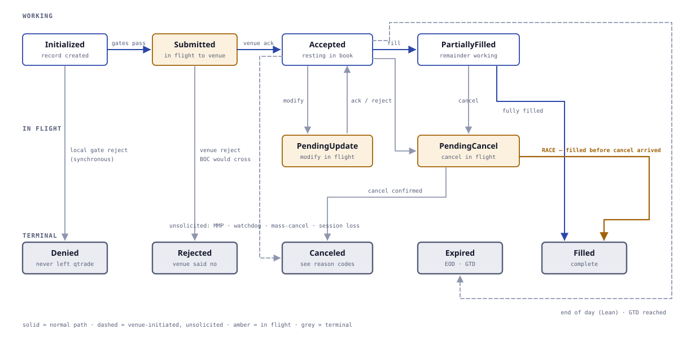

# Writing a Strategy for qtrade

**Audience:** engineers writing trading strategies.
**Prerequisite:** [CONTEXT.md](CONTEXT.md) for vocabulary. [ARCHITECTURE.md](ARCHITECTURE.md) for how qtrade works underneath.

> Strategy code is **identical in Backtest Mode and Live Mode**. You do not write a backtest version and a live version. That guarantee is the reason for most of the constraints in §11 — break those and it stops holding.

---

## 1. What a strategy is, and is not

**A strategy is:** a struct holding your own state, implementing the `Strategy` trait, reacting to events and submitting orders.

**A strategy is not:** a place for I/O, threads, timers of its own, wall-clock reads, or randomness. Everything reaches you through the context handle, and that is what makes a run reproducible.

**You own** fair value, skew, roll policy, quoting logic, and which instruments you want.
**qtrade owns** decoding, order books, the clock, order lifecycle, costs, validation and accounting.

---

## 2. The trait

```rust
pub trait Strategy {
    /// Called once, before any market data. Declare what you need.
    fn on_start(&mut self, ctx: &mut StartCtx) -> Result<(), StrategyError>;

    /// Warmup is over. You may now quote.
    fn on_warmup_complete(&mut self, ctx: &mut Ctx) {}

    /// A subscribed book changed, within the depth you subscribed to.
    fn on_book(&mut self, ctx: &mut Ctx, instrument: InstrumentId) {}

    /// A trade printed on a subscribed instrument.
    fn on_trade(&mut self, ctx: &mut Ctx, trade: &Trade) {}

    /// One of your orders filled, fully or partially.
    fn on_fill(&mut self, ctx: &mut Ctx, fill: &Fill) {}

    /// One of your orders changed state at the venue.
    fn on_order_update(&mut self, ctx: &mut Ctx, update: &OrderUpdate) {}

    /// A timer or alarm you scheduled has fired.
    fn on_timer(&mut self, ctx: &mut Ctx, timer: TimerId) {}

    /// A venue opened, closed, halted, or entered an auction.
    fn on_session_change(&mut self, ctx: &mut Ctx, venue: VenueId, phase: SessionPhase) {}

    /// A book became STALE, started RECOVERING, or returned to OK.
    fn on_book_state_change(&mut self, ctx: &mut Ctx,
                            instrument: InstrumentId, state: BookState) {}

    /// Shutting down. Last chance to clean up.
    fn on_stop(&mut self, ctx: &mut Ctx) {}
}
```

Every callback except `on_start` has a default empty body — implement only what you use.

**All callbacks run inline on the qtrade thread**, one strategy after another. Work done here is work the whole engine waits for. For anything expensive, see §10.

---

## 3. Lifecycle

```
construct  →  on_start  →  bootstrap  →  warmup  →  on_warmup_complete  →  running  →  on_stop
                 │            │            │                                   │
          declare needs   books build   events flow                     events + quoting
                                        quoting BLOCKED
```

**`on_start`** is the only place you can declare instruments, dependencies and time series. Market data has not started.

**Bootstrap** builds books — either full-day replay or from a snapshot (see [D14](ARCHITECTURE-DECISIONS.md)). Books are `UNINIT` until it completes.

**Warmup** delivers events so your models can converge. **You receive callbacks but cannot quote.** Any `submit` here is rejected.

**`on_warmup_complete`** means quoting is permitted — assuming the other gates in §6 also pass.

---

## 4. `on_start` — declaring what you need

```rust
fn on_start(&mut self, ctx: &mut StartCtx) -> Result<(), StrategyError> {
    // Parameters come from the [run] section of the config file.
    self.underlying   = ctx.param_str("underlying")?;        // "CRUDEOIL"
    self.n_expiries   = ctx.param_usize("expiries")?;        // 2
    self.max_position = ctx.param_i64("max_position")?;
    self.base_spread  = ctx.param_ticks("base_spread")?;

    // 1. Instrument filter — a PREDICATE, not a fixed list.
    //    Resolved against today's instrument master.
    //    Include contracts you will roll into, or they will have no book
    //    when you get there.
    let quoted = ctx.instruments()
        .venue(Venue::MCX)
        .underlying(&self.underlying)
        .kind(InstrumentKind::Future)
        .front_n_expiries(self.n_expiries)
        .collect();

    let cme    = ctx.instruments().venue(Venue::CME).symbol("CL").front()?;
    let usdinr = ctx.instruments().venue(Venue::DGCX).symbol("INR").front()?;

    // 2. Subscriptions — depth matters. You are woken only when the
    //    depth you asked for changes.
    for i in &quoted {
        ctx.subscribe(*i, Depth::Levels(5))?;
    }
    ctx.subscribe(cme,    Depth::Levels(5))?;
    ctx.subscribe(usdinr, Depth::Top)?;

    // 3. Declared dependencies — the watchdog CANCELS your orders if any
    //    of these goes stale beyond its tolerance, whether or not you notice.
    ctx.depends_on(cme,    Duration::from_millis(500))?;
    ctx.depends_on(usdinr, Duration::from_secs(5))?;
    for i in &quoted {
        ctx.depends_on(*i, Duration::from_millis(200))?;   // the venue you quote on
    }

    // 4. Time series — pre-registered so publishing costs no lookup.
    self.ts_fair = ctx.register_series("fair_value")?;
    self.ts_skew = ctx.register_series("skew_ticks")?;

    self.quoted = quoted;
    self.cme    = cme;
    self.usdinr = usdinr;
    Ok(())
}
```

**Four things to get right here.**

**Declare a predicate, not a list.** Your filter is resolved once against the day's master. A contract not in it has no book — so when you roll next week and subscribe to it, you get an empty book in a market that has been trading for hours. `front_n_expiries(2)` covers the one you will roll into.

**Subscribe at the depth you actually use.** Asking for 5 levels when you only read the top means being woken on changes you will ignore — on the single qtrade thread, which every other strategy shares.

**Declare your dependencies, including the venue you quote on.** A stale MCX book is more dangerous than a stale CME price: you are quoting into a market whose state you have lost.

**Never `unwrap()` in `on_start`.** Return the error. A strategy that panics during startup takes down the run rather than failing cleanly.

---

## 5. Reading market data

Everything is read from the Cache. Reads are cheap and always reflect the current event.

```rust
fn on_book(&mut self, ctx: &mut Ctx, instrument: InstrumentId) {
    let book = ctx.book(instrument);

    let bid = book.best_bid();          // Option<PriceLevel>
    let ask = book.best_ask();
    let lvl = book.depth(2);            // third level down

    // MBO only — available on MCX, absent on CME/DGCX by type
    let ahead = book.queue_position(my_order_id);
}
```

**`queue_position` does not exist on an `MbpBook`.** That is deliberate: CME and DGCX give aggregated depth, so queue position is not computable there. Asking for it will not compile — which is better than receiving a plausible estimate you would mistake for a measurement.

**Books can be legitimately crossed.** On MBO feeds an aggressive order is published before the trade it causes, so `best_bid >= best_ask` is a normal transient state, not a bug. Do not assert against it.

**Always check state before acting:**

```rust
if ctx.book_state(instrument) != BookState::Ok { return; }
```

---

## 6. Placing orders

```rust
let result = ctx.submit(OrderRequest {
    instrument,
    side:      Side::Buy,
    price:     bid_px,                       // i64 ticks, never f64
    qty:       self.quote_size,
    kind:      OrderKind::Limit,
    tif:       TimeInForce::Day,
    exec_inst: ExecInst::BookOrCancel,       // post-only
    category:  OrderCategory::Lean,          // the quoting category
});

match result {
    Ok(id)   => self.bid_id = Some(id),
    Err(rej) => match rej {
        RejectReason::Validation(v) => { /* tick size, freeze qty — fix and retry */ }
        RejectReason::Rms(_)        => { /* policy said no */ }
        RejectReason::OtrBudget     => { /* slow down */ }
        RejectReason::NotQuotable   => { /* warmup, stale book, or watchdog */ }
    }
}
```

**`submit` returns synchronously — but only for local rejections.** Validation, RMS and the OTR governor all run inside qtrade before anything is sent, so they reject in nanoseconds with nothing having travelled. **A venue rejection arrives later, as `on_order_update`.**

That distinction is useful, not pedantic. A local reject means **no time has passed** — the book is unchanged, so correct the price and resubmit immediately. A venue reject means **a full round trip elapsed** — the market has moved, and resubmitting the same quote is probably wrong.

### Order types available

| | Use |
|---|---|
| `Limit` + `Day` | The quoting order |
| `ExecInst::BookOrCancel` | Post-only. **Rejected outright if it would cross.** |
| `TimeInForce::Ioc` | Deliberate liquidity taking, hedging, unwinding |
| `OrderKind::MarketToLimit` | Emergency flatten. Residual **rests as a limit**; it does not sweep. |

Stop, stop-limit and auction types are out of scope.

### Use Book-or-Cancel for quotes

Between your decision and your order's arrival the market moves. A plain limit can **cross the spread and take liquidity** — you pay the aggressor fee instead of earning the spread, and you get exactly the fill you did not want, at the worst moment. BOC makes that impossible.

### Modify down, do not cancel-replace

This is most of a market maker's P&L:

| Change | Queue priority |
|---|---|
| **Reduce quantity** | **Kept** |
| Increase quantity | **Lost** |
| Change price | **Lost** |

So `ctx.modify(id, new_qty)` to shrink a quote keeps your place in the queue. Cancelling and resubmitting the same price puts you at the back — behind everyone who arrived while you were away.

---

## 7. Following your orders

Order state lives in the Cache and is read the same way as books.

```rust
let order = ctx.order(id);              // Option<&Order>
order.state       // PendingNew | Working | PartiallyFilled | Filled | Cancelled | Rejected
order.filled_qty
order.leaves_qty
order.price

for o in ctx.live_orders(instrument) { /* everything working right now */ }
```

**React to fills in `on_fill`, not by polling.** By the time `on_fill` runs, your position is already updated in both accounting levels.

**Your view is always delayed.** A fill happened at the venue at time T; you learn at `T + inbound latency`. That is true in live and modelled in backtest — do not write logic that assumes otherwise.

---

## 7a. Order states



> If the diagram does not render, open [order-state-machine.svg](order-state-machine.svg) directly in a browser.

**Eleven states.** Nautilus defines fifteen; we drop `EMULATED` and `RELEASED` (no order emulator), `TRIGGERED` (no stop orders — D12), and `VOIDED` (no contingent orders).

| State | Meaning | Group |
|---|---|---|
| `Initialized` | Record created, gates not yet run | local |
| `Denied` | **A local gate rejected it. It never left qtrade.** | **terminal** |
| `Submitted` | Passed the gates, in flight to the venue | in flight |
| `Accepted` | Venue acknowledged, resting in the book | open |
| `Rejected` | Venue refused it | **terminal** |
| `PartiallyFilled` | Some quantity filled, remainder working | open |
| `Filled` | Fully filled | **terminal** |
| `PendingUpdate` | Modify sent, awaiting venue response | in flight, open |
| `PendingCancel` | Cancel sent, awaiting venue response | in flight, open |
| `Canceled` | Removed from the book | **terminal** |
| `Expired` | Removed by time — end of day for Lean, or GTD reached | **terminal** |

**Groupings worth having in code:**

```rust
order.is_open()      // Accepted | PartiallyFilled | PendingUpdate | PendingCancel
order.is_inflight()  // Submitted | PendingUpdate | PendingCancel
order.is_terminal()  // Denied | Rejected | Filled | Canceled | Expired
```

`is_open()` is the one you want when asking *"do I still have a quote in the market?"* — and note that it includes `PendingCancel`, because until the venue confirms, **you are still exposed**.

### Transitions

| From | To | Cause |
|---|---|---|
| `Initialized` | `Denied` | Validation, RMS or OTR rejected — **synchronous return** |
| `Initialized` | `Submitted` | All three gates passed |
| `Submitted` | `Accepted` | Venue acknowledged |
| `Submitted` | `Rejected` | Venue refused — bad price, freeze qty, **BOC would have crossed** |
| `Submitted` | `PartiallyFilled` / `Filled` | Immediate execution (IOC, or aggressive) |
| `Accepted` | `PartiallyFilled` / `Filled` | Execution |
| `Accepted` / `PartiallyFilled` | `PendingUpdate` | You sent a modify |
| `Accepted` / `PartiallyFilled` | `PendingCancel` | You sent a cancel |
| `Accepted` / `PartiallyFilled` | `Canceled` | **Unsolicited** — see reasons below |
| `Accepted` / `PartiallyFilled` | `Expired` | End of day (Lean), GTD reached |
| `PendingUpdate` | `Accepted` / `PartiallyFilled` | Modify accepted **or rejected** — either way the order is working again |
| `PendingCancel` | `Canceled` | Cancel confirmed |
| `PendingCancel` | **`Filled`** | **Race — it filled before your cancel arrived** |
| `PartiallyFilled` | `Filled` | Remainder executed |

### The race you must handle

**`PendingCancel` → `Filled` is not an edge case.** You cancel a quote because the market moved; in the time your cancel is in flight, an aggressor takes the order you were trying to pull. You get a fill on a quote you had already decided was wrong.

A strategy that assumes "I cancelled, therefore I am flat" will be wrong, and wrong in the direction that hurts — those fills are adversely selected by construction. **Treat position as authoritative, never your own intent.**

### Cancellation reasons

`Canceled` is one state with several causes, and they need different responses:

| Reason | Meaning | Typical response |
|---|---|---|
| `Strategy` | You asked | expected |
| `Watchdog` | A declared dependency went stale (D28) | do not requote until inputs recover |
| `Mmp` | **Venue** market-maker protection tripped | you were filled hard and fast — reassess before returning |
| `SessionLoss` | Session dropped; Lean orders auto-cancelled | reconcile before quoting (D38) |
| `EndOfDay` | Lean orders cleared at close | expected |
| `MassCancel` | Venue-wide or member-wide cancel | investigate |
| `Risk` | RMS pulled it | do not retry blindly |

```rust
fn on_order_update(&mut self, ctx: &mut Ctx, u: &OrderUpdate) {
    if let OrderState::Canceled { reason } = u.state {
        match reason {
            CancelReason::Mmp | CancelReason::Watchdog => self.stand_down(ctx),
            CancelReason::Strategy | CancelReason::EndOfDay => {}
            _ => ctx.log(format!("unexpected cancel: {reason:?}")),
        }
    }
}
```

---

## 8. Positions and P&L — two levels

```rust
// Your strategy's own sub-account
let pos  = ctx.position(instrument);        // net, avg price, realised, unrealised
let pnl  = ctx.pnl();                       // across all your instruments

// The firm, netted across every strategy
let firm     = ctx.firm_position(instrument);
let firm_pnl = ctx.firm_pnl();
```

**Skew on your own inventory, not the firm's.** If two market makers shared one inventory number, each would see the other's fills as its own and skew against flow it never traded.

**Read the firm view to degrade gracefully.** You can be rejected because *another* strategy consumed the firm budget. Widening or standing down as the firm approaches a limit is better than discovering it through a rejection.

**P&L is net of costs** — see §9.

---

## 9. Costs — query before you quote

```rust
let cost = ctx.cost().round_trip(instrument, qty, Side::Buy);
if edge_ticks <= cost.in_ticks(instrument) {
    return;                      // this quote loses money by construction
}
```

**This matters more than it looks.** There is no market-maker fee concession, so you pay full retail on both legs of every round trip. **Round-trip cost is a hard floor on the spread you can profitably quote.**

Costs are **direction-asymmetric** — CTT falls on the sell side, stamp duty on the buy side — so do not model cost as one flat number.

The same model is applied to your realised fills, so your quoting assumption and your accounting cannot disagree.

---

## 10. Timers, dependencies and expensive work

```rust
let t = ctx.set_timer(Duration::from_secs(1));      // relative
let a = ctx.set_alarm(session_close - Duration::from_secs(60));
```

Timers fire through `on_timer`. **Never sleep, never poll a clock.**

**For expensive computation** — anything you would not want the whole engine waiting on — offload it:

```rust
ctx.offload(RecalibrateJob { .. });        // result arrives as a scheduled event
```

The result comes back as an event rather than blocking, so determinism holds and the quoting loop is never stalled behind it.

---

## 11. The rules

These are what make a run reproducible and keep backtest and live honest. Breaking any of them silently breaks parity.

| Never | Instead |
|---|---|
| `SystemTime::now()`, `Instant::now()` | `ctx.now()` |
| `rand::random()` | `ctx.rng()` — seeded from config |
| `println!`, file writes, network calls | `ctx.log()`, `ctx.publish(series, value)` |
| `thread::spawn`, `sleep` | `ctx.set_timer()`, `ctx.offload()` |
| Static mutable state | Fields on your struct |
| `f64` for prices | `i64` ticks |

**Why it is strict.** FR-12 requires a recorded live session, replayed through qtrade, to produce a **byte-identical decision stream**. One wall-clock read makes that impossible — and with it, the ability to prove that what you backtested is what you deployed.

---

## 12. Publishing what you were thinking

```rust
ctx.publish(self.ts_fair, fair_value);
ctx.publish(self.ts_skew, skew_ticks as f64);
```

Fills tell you what the strategy **did**. These tell you what it **believed** — and when a backtest result looks wrong, that difference is usually the whole investigation. Publish fair value, skew, quote width, and any signal input you would want to plot against a bad fill.

Cheap when the tier is disabled, identical API in both modes, and in live it feeds monitoring.

---

## 13. A worked example

A minimal Crude market maker: price from CME and USD/INR, skew on inventory, quote both sides.

```rust
pub struct CrudeMaker {
    quoted:   Vec<InstrumentId>,
    cme:      InstrumentId,
    usdinr:   InstrumentId,
    bid_id:   Option<ClOrdId>,
    ask_id:   Option<ClOrdId>,
    quote_size:   i64,
    base_spread:  i64,
    max_position: i64,
    skew_per_lot: f64,
    ts_fair: SeriesId,
    ts_skew: SeriesId,
}

impl Strategy for CrudeMaker {
    fn on_start(&mut self, ctx: &mut StartCtx) -> Result<(), StrategyError> {
        /* as in §4 */
        Ok(())
    }

    fn on_book(&mut self, ctx: &mut Ctx, _changed: InstrumentId) {
        if !ctx.can_quote() { return; }              // warmup, reconciliation, watchdog

        let front = self.quoted[0];
        if ctx.book_state(front) != BookState::Ok { return; }

        // ---- fair value: CME in USD × USDINR → INR ----
        let (Some(cme_bid), Some(cme_ask)) =
            (ctx.book(self.cme).best_bid(), ctx.book(self.cme).best_ask()) else { return };
        let Some(fx) = ctx.book(self.usdinr).mid() else { return };

        let cme_mid = (cme_bid.price + cme_ask.price) / 2;
        let fair    = ctx.ticks(front, cme_mid.as_f64() * fx * CONTRACT_RATIO);
        ctx.publish(self.ts_fair, fair.as_f64());

        // ---- skew on OWN inventory ----
        let pos  = ctx.position(front).net_qty;
        let skew = -(pos as f64 * self.skew_per_lot) as i64;
        ctx.publish(self.ts_skew, skew as f64);

        // ---- does the spread clear costs? ----
        let cost = ctx.cost().round_trip(front, self.quote_size, Side::Buy);
        let half = self.base_spread.max(cost.in_ticks(front) + 1) / 2;

        let bid_px = fair + skew - half;
        let ask_px = fair + skew + half;

        // ---- stop quoting a side at the position limit ----
        let want_bid = pos < self.max_position;
        let want_ask = pos > -self.max_position;

        self.requote(ctx, front, Side::Buy,  want_bid.then_some(bid_px));
        self.requote(ctx, front, Side::Sell, want_ask.then_some(ask_px));
    }

    fn on_fill(&mut self, ctx: &mut Ctx, fill: &Fill) {
        ctx.log(format!("fill {} @ {} pos now {}",
                fill.qty, fill.price, ctx.position(fill.instrument).net_qty));
        // on_book will requote with the new skew on the next book change
    }

    fn on_book_state_change(&mut self, ctx: &mut Ctx,
                            instrument: InstrumentId, state: BookState) {
        if state != BookState::Ok {
            ctx.cancel_all(instrument);      // do not rest quotes against a book you have lost
        }
    }

    fn on_session_change(&mut self, ctx: &mut Ctx, venue: VenueId, phase: SessionPhase) {
        if venue == Venue::MCX && phase != SessionPhase::Continuous {
            ctx.cancel_all_mine();
        }
    }
}
```

`requote` is where the priority discipline from §6 lives:

```rust
fn requote(&mut self, ctx: &mut Ctx, inst: InstrumentId,
           side: Side, target: Option<Price>) {
    let existing = self.id_for(side);

    match (existing, target) {
        (Some(id), None)      => { ctx.cancel(id).ok(); self.clear(side); }
        (None,     None)      => {}
        (Some(id), Some(px)) if ctx.order(id).map(|o| o.price) == Some(px) => {
            // already at the right price — leave it alone and KEEP THE QUEUE POSITION
        }
        (Some(id), Some(px))  => { ctx.cancel(id).ok(); self.place(ctx, inst, side, px); }
        (None,     Some(px))  => { self.place(ctx, inst, side, px); }
    }
}
```

**The third arm is the important one.** A quote already at the right price must be left alone. Cancel-replacing it at the same price throws away your queue position for nothing — and queue position is most of the edge.

---

## 14. Common mistakes

**Requoting on every book event.** You are woken on every change within your subscribed depth. If the price you would quote has not changed, do nothing — every needless cancel-replace costs queue position and OTR budget.

**Skewing on the firm position.** Use `ctx.position()`, not `ctx.firm_position()`. Read the firm view to degrade gracefully; skew on your own.

**Assuming a fill means the market agreed with you.** You are filled precisely when someone wanted the other side. Check markout in the run report before believing a positive result.

**Ignoring `can_quote()`.** It covers warmup, position reconciliation after a restart, and the watchdog. Submitting without checking gets a `NotQuotable` rejection and burns OTR budget.

**Cancelling instead of modifying down.** Reducing quantity keeps priority. Almost nothing else does.

**Treating a local reject like a venue reject.** No time passed on a local reject. Fix and resubmit immediately.

**Not publishing your reasoning.** When a backtest is wrong you will want fair value and skew at the moment of the bad fill. Retrofitting means re-running everything.

---

## 15. Checklist before your first run

- [ ] Filter is a predicate covering contracts you will roll into
- [ ] Subscribed at the depth you actually read
- [ ] Every input declared via `depends_on`, including the venue you quote on
- [ ] `can_quote()` checked before every submit
- [ ] Book state checked before reading a book
- [ ] Quotes use `BookOrCancel` and `OrderCategory::Lean`
- [ ] Round-trip cost checked against intended spread
- [ ] Position limits stop quoting a side rather than only rejecting
- [ ] Cancel-all wired to session change and book-state change
- [ ] Fair value and skew published as series
- [ ] No wall clock, no unseeded randomness, no I/O, no threads
- [ ] Prices are `i64` ticks throughout
